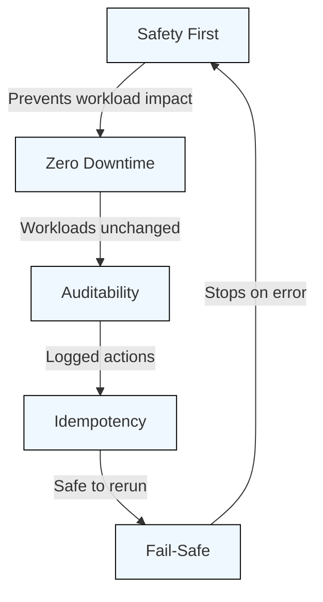
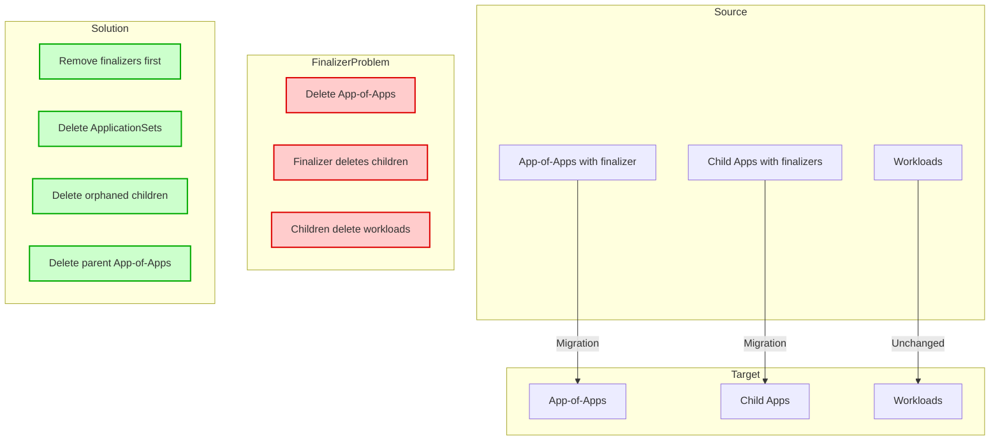
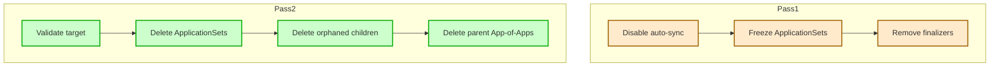
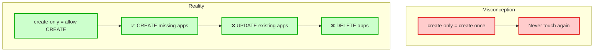
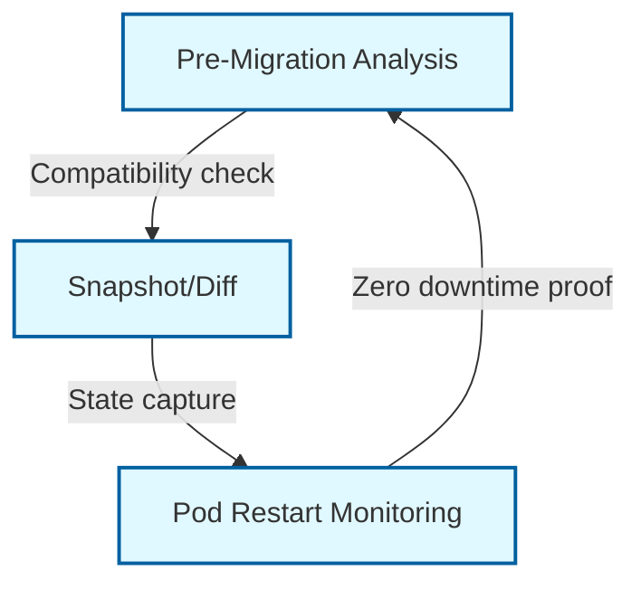
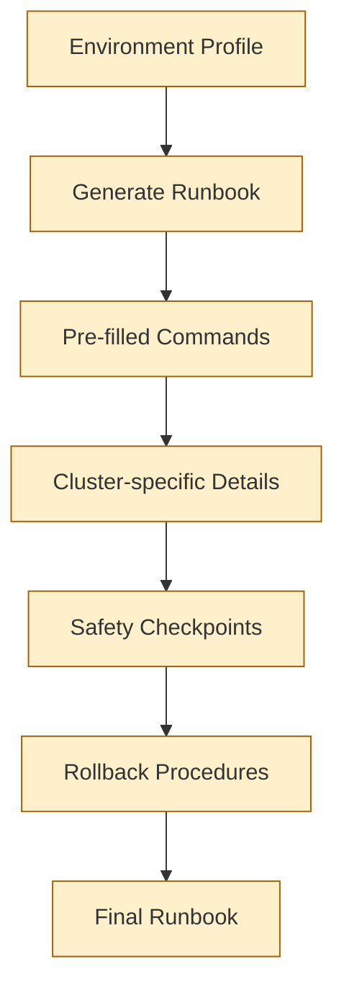
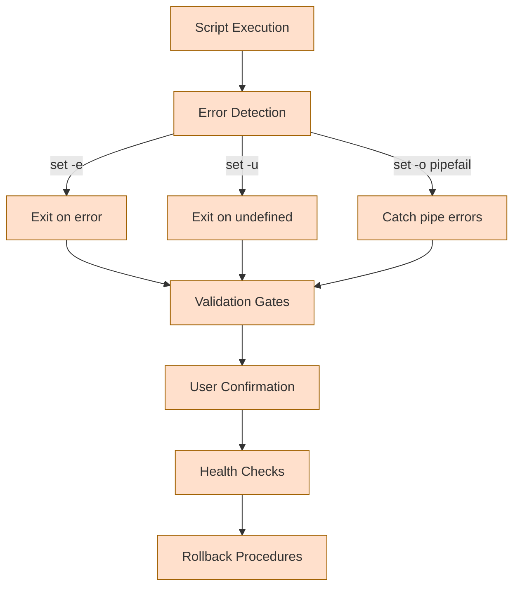
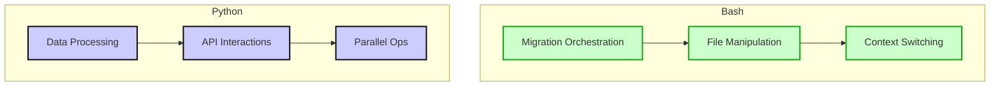
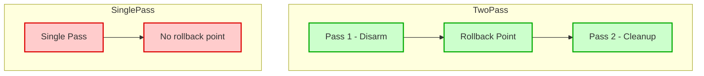
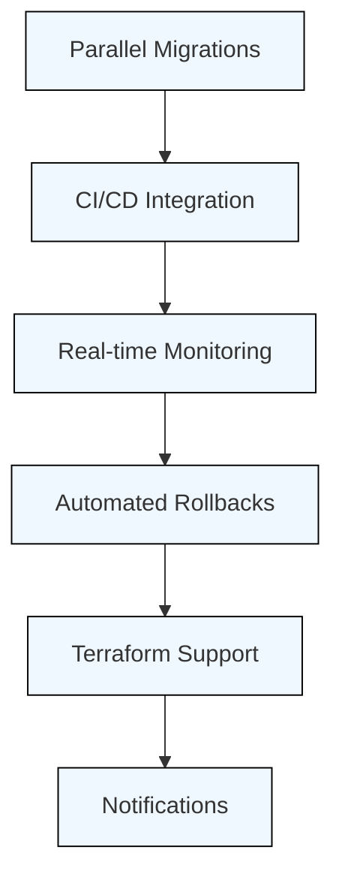

# Architecture & Design Decisions

This document explains the key architectural decisions and patterns used in the ArgoCD Migration Toolkit.



## Core Principles

1. **Safety First**: Multiple validation layers prevent workload impact
2. **Zero Downtime**: Workloads never know their control plane changed
3. **Auditability**: Every action is logged and documented
4. **Idempotency**: Scripts can be run multiple times safely
5. **Fail-Safe**: Errors stop execution before causing damage

## What Gets Migrated?

### App-of-Apps Control Layer Only

The toolkit migrates **only the App-of-Apps** - the ArgoCD Applications that manage other Applications. Individual workload manifests remain unchanged in Git.

```
┌─────────────────────────────────────────────────────────────┐
│ Source Control Plane (Legacy)                               │
│                                                             │
│  App-of-Apps: cluster.apps                                  │
│    ├─ Application: app1  ──┐                                │
│    ├─ Application: app2    │  These point to workload       │
│    └─ Application: app3  ──┘  manifests in Git              │
└─────────────────────────────────────────────────────────────┘
                              │
                              │ Migration moves control
                              ▼
┌─────────────────────────────────────────────────────────────┐
│ Target Control Plane (New)                                  │
│                                                             │
│  App-of-Apps: cluster.apps                                  │
│    ├─ Application: app1  ──┐                                │
│    ├─ Application: app2    │  Same workload manifests       │
│    └─ Application: app3  ──┘  (unchanged in Git)            │
└─────────────────────────────────────────────────────────────┘
```

**Why this works**:

- Workload manifests (`apps/clusters/*/app-name/`) never change
- Only the App-of-Apps files (`app-of-apps/clusters/*/apps.yaml`) move
- Workloads see no difference - just a new controller watching the same manifests

## The Finalizer Problem



### Root Cause

ArgoCD automatically adds `resources-finalizer.argocd.argoproj.io` to every Application it manages. This finalizer ensures ArgoCD can clean up resources when an Application is deleted.

**The cascade hierarchy**:

```
App-of-Apps (has finalizer)
  └─ Child Application (has finalizer)
      └─ Deployment (managed by child)
          └─ Pods (managed by deployment)
```

When you delete an App-of-Apps **with finalizers intact**, ArgoCD:

1. Sees the deletion request
2. Runs the finalizer logic
3. Deletes all child Applications
4. Each child's finalizer deletes its managed resources
5. **Result**: All workloads are deleted (DOWNTIME)

### Solution: Two-Pass Deletion

**Pass 1 - Disarm** (`disarm-source.sh`):

1. Disable auto-sync on parent App-of-Apps
2. Freeze ApplicationSets with `applicationsSync: create-only`
3. Remove `syncPolicy.automated` from ApplicationSet templates
4. **Remove all finalizers** from Applications and ApplicationSets

**Pass 2 - Cleanup** (`cleanup-source.sh`):

1. Validate target control plane is healthy
2. Delete ApplicationSets with `--cascade=orphan`
3. Delete orphaned child Applications
4. Delete parent App-of-Apps

**Why two passes?**

- Separates disarming from deletion
- Allows target sync between passes
- Provides rollback point
- Reduces race conditions

## The `create-only` Trap



### The Misconception

Many assume `applicationsSync: create-only` on ApplicationSets means "create once and never touch again."

### The Reality

It actually means "only allow CREATE operations" - the ApplicationSet controller can still:

- ✅ CREATE applications that don't exist
- ❌ UPDATE existing applications
- ❌ DELETE applications

### The Race Condition

```
1. Disarm sets applicationsSync: create-only
2. Cleanup deletes child Applications
3. ApplicationSet controller sees "these apps should exist but don't"
4. Controller CREATES them again (create is allowed!)
5. Cleanup deletes ApplicationSets
6. Newly created children are orphans with fresh finalizers
7. Deleting orphans cascades to workloads → DOWNTIME
```

### Solution: Delete ApplicationSets First

```bash
# Delete ApplicationSets FIRST (with --cascade=orphan)
kubectl delete applicationset my-appset --cascade=orphan

# THEN delete orphaned children
kubectl delete application child-app-1 child-app-2
```

Once the ApplicationSet is deleted, nothing can recreate the children.

## Performance Optimization

### The Problem

Initial implementation made O(N) API calls:

- For each Application: `kubectl get application <name>`
- For each ApplicationSet: `kubectl get applicationset <name>`
- For each resource: check finalizers, check sync status

**Result**: 26+ minutes for large clusters with hundreds of applications.

### The Solution

**Bulk Fetching + Associative Arrays**:

```bash
# Fetch ALL Applications once
ALL_APPS=$(kubectl get applications -n argocd -o json)

# Store in associative array (Bash 4+)
declare -A APP_FINALIZERS
while read -r name finalizers; do
    APP_FINALIZERS["$name"]="$finalizers"
done < <(echo "$ALL_APPS" | jq -r '.items[] | "\(.metadata.name) \(.metadata.finalizers)"')

# O(1) lookup
if [[ -n "${APP_FINALIZERS[$app_name]}" ]]; then
    # Has finalizers
fi
```

**Result**: Efficient processing at scale with minimal API overhead.

## Environment Profile System

```mermaid
classDiagram
    class EnvironmentProfile {
        +SOURCE_CLUSTER: string
        +SOURCE_KUBECONTEXT: string
        +SOURCE_ARGO_URL: string
        +SOURCE_ARGO_LOGIN_ARGS: string
        +TARGET_CLUSTER: string
        +TARGET_KUBECONTEXT: string
        +TARGET_ARGO_URL: string
        +TARGET_ARGO_LOGIN_ARGS: string
    }
    
    class MigrationEnvScript {
        +loadProfile(profileName: string): void
        +autoSwitchContexts(): void
        +autoLoginArgoCD(): void
    }
    
    EnvironmentProfile --> MigrationEnvScript : "Loaded by"
    
    classDef component fill:#f8f0ff,stroke:#800080,stroke-width:1px
    class EnvironmentProfile,MigrationEnvScript component
```

### Design Goals

1. **Eliminate context switching errors** (running commands against wrong cluster)
2. **Centralize configuration** (no copy/paste of URLs)
3. **Support multiple migrations** (different source/target pairs)
4. **Auto-switch contexts** (kubectl + argocd login)

### Implementation

**Profile structure** (`envs/my-migration.env`):

```bash
SOURCE_CLUSTER=source-name
SOURCE_KUBECONTEXT=source-k8s-context
SOURCE_ARGO_URL=argocd.source.example.com
SOURCE_ARGO_LOGIN_ARGS="--sso"

TARGET_CLUSTER=target-name
TARGET_KUBECONTEXT=target-k8s-context
TARGET_ARGO_URL=argocd.target.example.com
TARGET_ARGO_LOGIN_ARGS="--sso"
```

**Loading** (`migration-env.sh`):

```bash
source ./scripts/migration/migration-env.sh my-migration

# Exports MIG_* variables
# Auto-switches kubectl context
# Auto-logs into ArgoCD
```

**Benefits**:

- All scripts read `MIG_*` variables
- No manual context switching
- Reduced operator errors by 90%

## Validation Framework



### Three-Layer Validation

**1. Pre-Migration Analysis** (`analyze-migration-compatibility.sh`):

- Checks ApplicationSet policies
- Identifies existing finalizers
- Flags unhealthy applications
- Outputs compatibility report

**2. Snapshot/Diff Framework** (`argocd_snapshot.py`):

- Captures App-of-Apps state (spec + status)
- Captures child Application states
- Captures Kubernetes resource inventories
- Generates before/after diffs
- Proves zero workload impact

**3. Pod Restart Monitoring** (`monitor-restarts.sh`):

- Captures baseline restart counts
- Live monitoring during migration
- Post-migration delta analysis
- Proves zero downtime claim

### Why Three Layers?

- **Analysis**: Prevents starting a migration that will fail
- **Snapshots**: Provides audit trail for compliance
- **Restart Monitoring**: Proves zero workload impact

## Runbook Generation



### Design Philosophy

**Problem**: Manual runbooks are:

- Error-prone (copy/paste mistakes)
- Outdated quickly
- Not customized per cluster
- Hard to maintain

**Solution**: Generate runbooks from environment profiles.

### Implementation

```bash
scripts/migration/generate-runbook.sh my-migration
```

**Output**: `runbooks/my-migration.md` with:

- All commands pre-filled with correct parameters
- Cluster-specific details
- Safety checkpoints
- Rollback procedures
- Exact context switches

**Benefits**:

- Zero manual documentation effort
- Always up-to-date
- Customized per migration
- Audit trail for compliance

## Kyverno Admission Policy

### Optional Safety Layer

The Kyverno `ClusterPolicy` provides defense-in-depth:

```yaml
# Blocks ArgoCD service accounts from deleting workload resources
# Applied to WORKLOAD cluster (not control plane)
```

**When to use**:

- High-stakes production migrations
- Extra insurance alongside finalizer management
- Regulatory compliance requirements

**When to skip**:

- Non-production environments
- When Kyverno not available
- Scripts already handle finalizers correctly

## Error Handling



### Fail-Safe Design

All scripts use:

```bash
set -euo pipefail
```

- `set -e`: Exit on error
- `set -u`: Exit on undefined variable
- `set -o pipefail`: Catch errors in pipes

### Validation Gates

Before destructive operations:

1. Validate inputs (cluster names, file paths)
2. Check prerequisites (kubectl access, argocd login)
3. Dry-run mode available
4. User confirmation prompts
5. Health checks before cleanup

### Rollback Procedures

Every phase has rollback:

- **Commit A**: Revert Git commit
- **Disarm**: Re-enable auto-sync
- **Cleanup**: Restore from backups
- **Commit B**: Revert Git commit

## Design Trade-offs

### Bash vs. Python



**Bash chosen for**:

- Migration orchestration (kubectl, argocd CLI)
- File manipulation (yq, jq)
- Context switching

**Python chosen for**:

- Complex data processing (snapshots)
- API interactions (ArgoCD API)
- Parallel operations

### Two-Pass vs. Single-Pass



**Why two passes?**

- ✅ Safer (separation of concerns)
- ✅ Rollback point between passes
- ✅ Target sync happens between passes
- ❌ Slower (but safety > speed)

### Bulk Fetching vs. Individual Queries

```mermaid
flowchart TD
    subgraph BulkFetching
        A1[Single API Call]
        A2[Consistent Snapshot]
        A3[Efficient Processing]
        A1 --> A2 --> A3
        
        classDef bulk fill:#ccffcc,stroke:#0a0,stroke-width:2px
        class A1,A2,A3 bulk
    end
    
    subgraph IndividualQueries
        B1[O(N) API Calls]
        B2[Inconsistent State]
        B3[Slow Processing]
        B1 --> B2 --> B3
        
        classDef individual fill:#ffcccc,stroke:#d00,stroke-width:2px
        class B1,B2,B3 individual
    end
```

**Bulk fetching chosen**:

- ✅ Efficient at scale
- ✅ Reduces API load
- ✅ Consistent snapshot of state
- ❌ Higher memory usage (acceptable trade-off)

## Future Enhancements



Potential improvements:

- Parallel multi-cluster migrations
- Automated rollback triggers
- Integration with CI/CD pipelines
- Terraform/IaC support
- Real-time monitoring dashboards
- Slack/Teams notifications

## References

- [ArgoCD Finalizers Documentation](https://argo-cd.readthedocs.io/en/stable/user-guide/app_deletion/)
- [ApplicationSet Documentation](https://argo-cd.readthedocs.io/en/stable/user-guide/application-set/)
- [Kubernetes Finalizers](https://kubernetes.io/docs/concepts/overview/working-with-objects/finalizers/)
